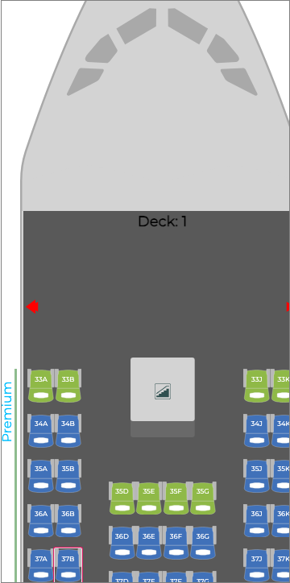
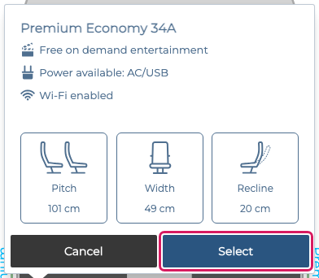
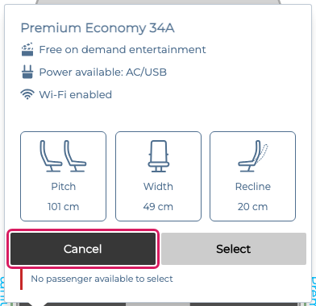
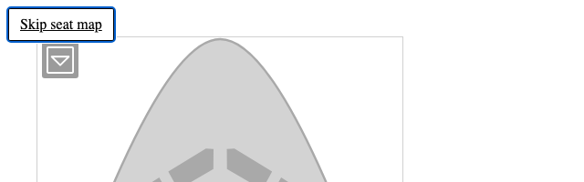
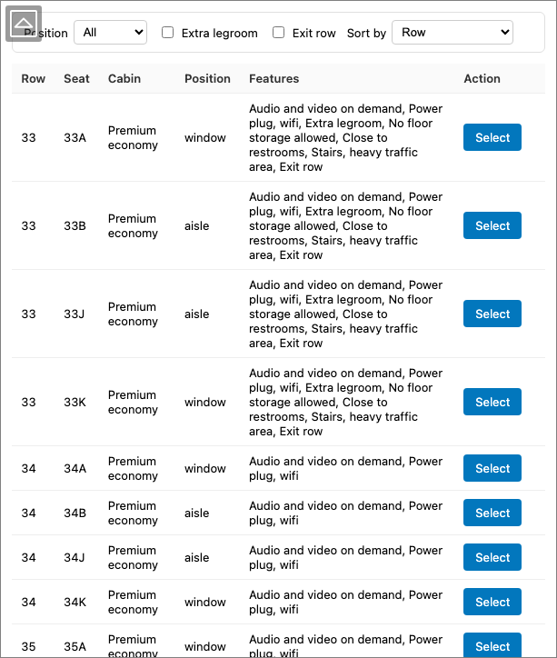

# Accessibility (WCAG 2.2 AA) integration guide

This guide is for developers integrating `@seatmaps.com/react-lib` into a product
that must meet **WCAG 2.2 Level AA**. It explains exactly what the component
supports, how to turn it on, what every configuration option does, and shows
real screenshots of each feature in action.

> **You only need this guide if accessibility conformance matters to you.**
> Every accessibility behaviour described here is **opt-in** and **off by
> default**. If you never set `config.wcag`, the component renders and behaves
> exactly as it did before this feature set existed — same DOM, same visuals,
> same events. Nothing changes for consumers who do not opt in.

---

## Contents

1. [Quick start](#1-quick-start)
2. [The `config.wcag` flag model](#2-the-configwcag-flag-model)
3. [Configuration reference](#3-configuration-reference)
4. [Supported WCAG 2.2 success criteria](#4-supported-wcag-22-success-criteria)
5. [Feature walkthrough (with screenshots)](#5-feature-walkthrough)
6. [Always-on behaviours](#6-always-on-behaviours)
7. [Host (page) responsibilities](#7-host-page-responsibilities)
8. [Known limitations](#8-known-limitations)
9. [Automated accessibility tests](#9-automated-accessibility-tests)
10. [Component overrides & accessibility](#10-component-overrides--accessibility)

---

## 1. Quick start

Turn on the full accessible experience with a single flag on the `config` prop:

```jsx
import { JetsSeatMap } from '@seatmaps.com/react-lib';

<JetsSeatMap
  flight={flight}
  passengers={passengers}
  config={{
    // ...your usual config (width, lang, colorTheme, apiUrl, ...)
    wcag: { enabled: true },
  }}
  onSeatSelected={handleSelected}
/>;
```

`wcag: { enabled: true }` switches on **all** accessibility features at once.
To adopt them selectively, enable individual flags instead (see below).

With WCAG enabled, a keyboard user can Tab into the map, move a visible focus
ring between seats with the arrow keys, open a seat's dialog with `Enter`,
operate its buttons with the keyboard, and hear every action announced by a
screen reader.

---

## 2. The `config.wcag` flag model

All accessibility behaviour lives under `config.wcag`, an object of feature
flags. The library resolves it once with these rules:

1. **Every flag defaults to `false`** (i.e. pre-WCAG behaviour) when `config.wcag`
   is omitted.
2. **`enabled: true` is a shortcut** — it flips every flag that you did *not*
   set explicitly to `true`. Flags you set to `false` stay `false`. This lets
   you say "everything on except one thing":

   ```js
   wcag: { enabled: true, liveAnnouncer: false } // all features except announcements
   ```

3. **`keyboardNavigation` requires `gridSemantics`.** If `gridSemantics`
   resolves to `false`, `keyboardNavigation` is forced to `false` (arrow
   navigation locates cells by their ARIA grid indices, which only exist when
   grid semantics are on).
4. **`alternativeView` is a three-state string**, not a boolean:
   `'grid' | 'list' | 'auto'`, default `'grid'`.

You can enable features one at a time for a gradual rollout:

```js
// Just the semantics + keyboard, nothing else:
wcag: { gridSemantics: true, keyboardNavigation: true }
```

---

## 3. Configuration reference

`config.wcag` (all optional):

| Option | Type | Default | Effect |
|---|---|---|---|
| `enabled` | `boolean` | `false` | Master shortcut — turns every flag below on unless it is explicitly `false`. |
| `gridSemantics` | `boolean` | `false` | Seats become ARIA `gridcell` buttons with accessible names; decks get `role="grid"`, rows `role="row"`, seats 1-based `aria-rowindex`/`aria-colindex`; a keyboard focus ring is added. |
| `keyboardNavigation` | `boolean` | `false` | 2-D arrow-key navigation across the grid with roving `tabindex`. **Implies `gridSemantics`.** |
| `tooltipDialog` | `boolean` | `false` | The built-in tooltip becomes a non-modal `role="dialog"` with keyboard-operable buttons. |
| `liveAnnouncer` | `boolean` | `false` | A polite `aria-live` region announces select / unselect / jump. |
| `visibleRestrictionReason` | `boolean` | `false` | A visible reason under a disabled **Select** button, tied to it with `aria-describedby`. |
| `landmarksAndSkipLink` | `boolean` | `false` | A `region` landmark with a hidden heading, a skip link (visible on focus), and `role="switch"` on the deck selector. |
| `alternativeView` | `'grid' \| 'list' \| 'auto'` | `'grid'` | Render mode: visual grid, a semantic table of all seats, or `'auto'` (table below 480px). |
| `defaultColorTheme` | `boolean` | `false` | **Reserved / not implemented.** This library ships no default palette; colour contrast is your `colorTheme`'s responsibility (see [§7](#7-host-page-responsibilities)). |

`config.alternativeView` (top-level, **deprecated**) is read as a fallback when
`config.wcag.alternativeView` is unset. Prefer `config.wcag.alternativeView`.

---

## 4. Supported WCAG 2.2 success criteria

When the relevant flags are enabled, the component supports the following Level
A / AA criteria. A full conformance matrix (including *Not applicable* and
*Host responsibility* rows) is in [`ACR.md`](./ACR.md).

| SC | Name | Enabled by |
|---|---|---|
| 1.1.1 (A) | Non-text Content | always-on (`aria-hidden` on decorative graphics) |
| 1.3.1 (A) | Info and Relationships | `gridSemantics` |
| 1.4.11 (AA) | Non-text Contrast | `gridSemantics` (focus ring) + always-on forced-colors |
| 1.4.13 (AA) | Content on Hover or Focus | `tooltipDialog` |
| 2.1.1 (A) | Keyboard | `keyboardNavigation` + `tooltipDialog` |
| 2.4.1 (A) | Bypass Blocks | `landmarksAndSkipLink` |
| 2.4.3 (A) | Focus Order | `keyboardNavigation` |
| 2.4.7 (AA) | Focus Visible | `gridSemantics` |
| 2.4.11 (AA) | Focus Not Obscured (Min.) | `keyboardNavigation` |
| 2.5.8 (AA) | Target Size (Min.) | `alternativeView` (list is the non-visual path) |
| 3.3.1 (A) | Error Identification | `visibleRestrictionReason` |
| 3.3.3 (AA) | Error Suggestion | `visibleRestrictionReason` |
| 4.1.2 (A) | Name, Role, Value | `gridSemantics`, `tooltipDialog` |
| 4.1.3 (AA) | Status Messages | `liveAnnouncer` |

---

## 5. Feature walkthrough

### 5.1 Grid semantics & focus ring — `gridSemantics`

Real seats render as `<button type="button" role="gridcell">` with an accessible
name (e.g. *"14C, aisle, extra legroom, available, €12"*), `aria-selected`,
`aria-disabled` (not the native `disabled`, so the cell stays focusable), and
1-based `aria-rowindex`/`aria-colindex`. Decks are `role="grid"` with
`aria-rowcount`/`aria-colcount`; rows are `role="row"`. A keyboard focus ring
(`:focus-visible`) marks the current seat.

*SC 1.3.1, 2.4.7, 1.4.11, 4.1.2.*

```js
wcag: { gridSemantics: true }
```



*The focused seat carries a high-contrast focus ring that stays visible on any
seat colour and on the deck floor.*

### 5.2 Keyboard navigation — `keyboardNavigation`

The whole grid is a **single tab stop** (roving `tabindex`). Once focus is
inside, move it with the keyboard:

| Key | Action |
|---|---|
| Arrow keys | Move one seat (skipping spacers) |
| `Home` / `End` | First / last seat in the row |
| `Ctrl`+`Home` / `Ctrl`+`End` | First / last seat of the deck |
| `PageUp` / `PageDown` | ±5 rows |
| `Ctrl`+Arrow | Jump to the next selectable seat |
| `Enter` / `Space` | Open the seat's tooltip / select |

The focused seat is kept in view as you navigate (it scrolls within its own
container, not the whole page). *SC 2.1.1, 2.4.3, 2.4.11.*

```js
wcag: { keyboardNavigation: true } // implies gridSemantics
```

### 5.3 Tooltip as a dialog — `tooltipDialog`

The built-in tooltip becomes a non-modal `role="dialog"`. On open, focus moves
to the primary action (**Select** / **Unselect**); the **Left/Right** arrows
rove between the tooltip's buttons (seat navigation is paused while it is open);
`Enter`/`Space` activate a button; `Escape` closes it and returns focus to the
originating seat, after which grid navigation resumes.

*SC 1.4.13, 2.1.1, 4.1.2.*

```js
wcag: { tooltipDialog: true }
```



*The tooltip is a dialog; its buttons are reachable and operable by keyboard,
each with a visible focus ring.*

### 5.4 Visible restriction reason — `visibleRestrictionReason`

When **Select** is disabled (no eligible passenger, or a passenger-type
restriction), a visible sentence explains *why*, wired to the button with
`aria-describedby` so assistive tech announces it. *SC 3.3.1, 3.3.3.*

```js
wcag: { visibleRestrictionReason: true }
```



*A disabled **Select** shows a human-readable reason ("No passenger available to
select"), linked to the button via `aria-describedby`.*

### 5.5 Landmarks & skip link — `landmarksAndSkipLink`

The map is wrapped in a `role="region"` landmark with a visually-hidden heading.
A **skip link** — hidden until it receives keyboard focus — lets keyboard users
jump past the whole map. The deck selector gains `role="switch"` semantics.
*SC 2.4.1.*

```js
wcag: { landmarksAndSkipLink: true }
```



*Pressing Tab reveals the "Skip seat map" link; it is invisible otherwise.*

### 5.6 Live announcements — `liveAnnouncer`

A visually-hidden `aria-live="polite"` region announces seat selection,
clearing, and jump-to-seat, so non-visual users get feedback for actions that
otherwise only change the map visually. The running selected-seat **total** is
intentionally *not* announced — that is your application's responsibility.
*SC 4.1.3.*

```js
wcag: { liveAnnouncer: true }
```

*(No screenshot — this feature is audible only. Inspect the DOM for the hidden
`div[aria-live="polite"]` inside the seat map, or listen with a screen reader.)*

### 5.7 Alternative list view — `alternativeView`

A fully semantic `<table>` of every seat — with column headers, filters
(window / aisle / extra legroom / exit row) and sorting — as an alternative to
the visual diagram. It uses the same selection handlers and fires the same
callbacks as the grid, so state stays in sync.

```js
wcag: { enabled: true, alternativeView: 'list' } // always list
wcag: { enabled: true, alternativeView: 'auto' } // list below 480px, grid otherwise
```

- `'grid'` (default) — the visual map only.
- `'list'` — always the table.
- `'auto'` — the table below `480px` viewport width, the grid above. A
  **"View as list / View as map" toggle button appears only in `'auto'` mode**
  (so the user can override the automatic choice). In pinned `'grid'` or
  `'list'` mode there is no toggle button.

*SC 2.5.8 (the list provides a large, non-diagram interaction path).*



*The list view: a real `<table>` with `<caption>`, `<th scope="col">` headers,
filters, sort, and a Select control per row.*

---

## 6. Always-on behaviours

These three improvements are **always active** (no flag) because they are
invisible to sighted users and only take effect for assistive tech or specific
OS settings — they never change the default visual output or behaviour:

- **Decorative graphics are hidden from assistive tech** (`aria-hidden` on the
  fuselage, nose, tail, wings, deck separators, bulks, exits, seat icons, and
  amenity icons), so screen readers announce only meaningful content. *SC 1.1.1.*
- **`prefers-reduced-motion` is respected** — the loading spinner animation is
  disabled when the user requests reduced motion.
- **Forced-colors / Windows High Contrast support** — `@media (forced-colors:
  active)` rules keep seat outlines, the focus ring, exits, the deck selector
  and deck separators perceivable when the OS flattens colours.

---

## 7. Host (page) responsibilities

Some criteria can only be satisfied by the page that embeds the component. The
library cannot do these for you:

- **2.4.2 Page Titled** — set a descriptive `<title>`.
- **3.1.1 / 3.1.2 Language** — set `<html lang>` (and `lang` on parts if the
  page is multilingual).
- **1.4.3 Contrast (Minimum)** — the component renders your `config.colorTheme`.
  Choose seat/label/background colours that meet 4.5:1 (text) and 3:1 (UI). The
  library has no default AA palette to impose (hence `defaultColorTheme` is
  unimplemented).
- **3.3.7 / 3.3.8 Redundant Entry / Accessible Authentication** — any auth or
  checkout flow around the map.
- **Announcing the running total** of selected seats — you receive the
  `onSeatSelected` / `onSeatUnselected` callbacks; announce the total if needed.

---

## 8. Known limitations

- **Horizontal mode.** With `config.horizontal`, the map is a CSS 90° rotation.
  Arrow keys are remapped to the on-screen direction, but tooltip positioning
  under the rotation is not fully corrected. Vertical (default) orientation is
  the fully-supported keyboard path.
- **Deck selector for 3+ decks.** The `role="switch"` semantics fit the common
  2-deck toggle. Aircraft with 3+ decks would need `role="tablist"` semantics —
  not yet implemented.

---

## 9. Automated accessibility tests

The repository ships `jest-axe` unit suites for the seat, the dialog tooltip,
the list view, and a full seat-map render with `wcag.enabled`. They are written
to **auto-skip** when `jest-axe` is not installed, so they never break a build
that has not opted in. Install `jest-axe` (in an environment where your
dependency policy permits it) and they run automatically:

```bash
pnpm add -D jest-axe
pnpm test        # the *.axe.test.js suites now execute
```

---

## 10. Component overrides & accessibility

If you replace `JetsSeat`, `JetsTooltip`, or `JetsTooltipView` via
`config.componentOverrides`, **you take over responsibility for the ARIA
semantics** of the replaced part (roles, accessible names, focus handling,
dialog behaviour). The built-in accessibility described here applies to the
default components.

---

For the complete, per-criterion conformance record, see
[**`ACR.md`**](./ACR.md).
